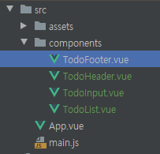
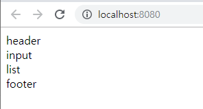
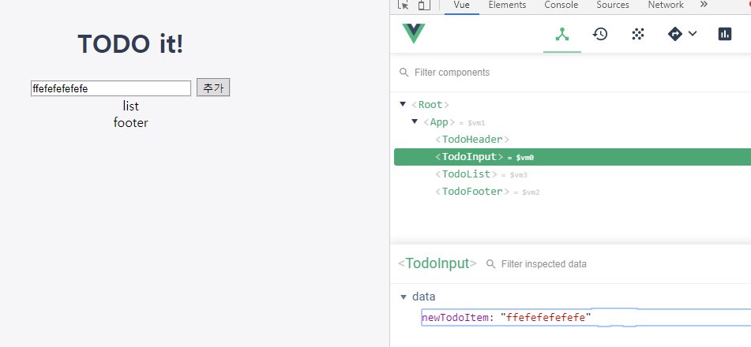
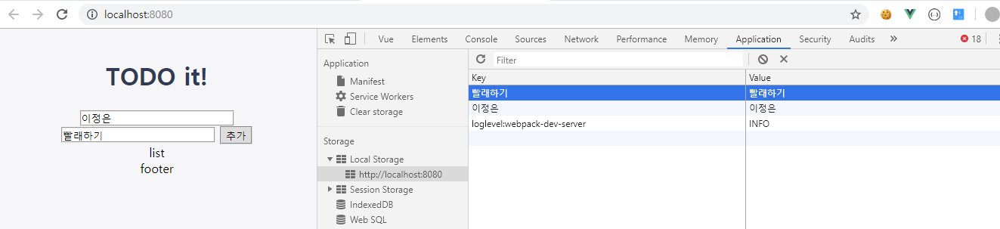
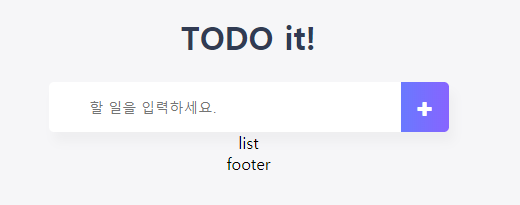

[TOC]

---

# vue-todo

> A Vue.js project  : [예시 사이트](https://vuejstodo-aa185.firebaseapp.com/)

<br>

## 프로젝트 생성

> `$ mkdir vue-todo`
>
> `$ cd vue-todo/`
>
> ```bash
>$ vue init webpack-simple
> 
>? Generate project in current directory? (Y/n) Y
> ? Generate project in current directory? Yes
> ? Project name (vue-todo) 
> ? Project name vue-todo
> ? Project description (A Vue.js project) 
> ? Project description A Vue.js project
> ? Author (jungeunlee95 <leeap1004@gmail.com>)
> ? Author jungeunlee95 <leeap1004@gmail.com>
> ? License (MIT)
> ? License MIT
> ? Use sass? (y/N) N
> ? Use sass? No
> 
> vue-cli · Generated "vue-todo".
> 
> To get started:
> 
>      npm install
>   npm run dev
>    ```
> 

의존성 항목 설치

`npm install vue vue-loader vue-template-compiler webpack webpack-cli webpack-d`

<br>

## index.html link, meta tag 추가

```html
<!--viewport meta tag-->
<meta name="viewport" content="width=device-width, initial-scale=1.0">
<!--font awesome cdn-->
<link rel="stylesheet" href="https://use.fontawesome.com/releases/v5.0.12/css/all.css">

<!--font, favicon settings - favicon generator-->
<link rel="shortcut icon" href="src/assets/favicon.ico" type="image/x-icon">
<link rel="icon" href="src/assets/favicon.ico" type="image/x-icon">
<link href="https://fonts.googleapis.com/css?family=Ubuntu" rel="stylesheet">
```

<br>

## 컴포넌트 생성

- 사용할 컴포넌트는 총 4개.
  1. TodoHeader
  2. TodoInput
  3. TodoList
  4. TodoFooter

> 프로젝트 구조 `>src>components>..`
>
> 

**각각의 컴포넌트 내용 설정** **ex) TodoFooter.vue**

```vue
<template>
  <div>footer</div>
</template>

<script>
    export default {

    }
</script>

<style>

</style>
```

<br>

## App.vue에 컴포넌트 추가

```vue
<template>
  <div id="app">
    <TodoHeader></TodoHeader>
    <TodoInput></TodoInput>
    <TodoList></TodoList>
    <TodoFooter></TodoFooter>
  </div>
</template>

<script>
    import TodoHeader from "./components/TodoHeader";
    import TodoList from "./components/TodoList";
    import TodoInput from "./components/TodoInput";
    import TodoFooter from "./components/TodoFooter";

    export default {
        components: {
            'TodoHeader' : TodoHeader,
            'TodoInput' : TodoInput,
            'TodoList' : TodoList,
            'TodoFooter' : TodoFooter,
        }
    }
</script>

<style>

</style>
```

<br>

## Vue 프로젝트 실행

`npm run dev`



<br>

## style 지정

**App.vue**

```vue
<style>
    body {
        text-align: center;
        background-color: #F6F6F8;
    }

    input {
        border-style: groove;
        width: 200px;
    }

    button {
        border-style: groove;
    }

    .shadow{
        box-shadow: 5px 10px 10px rgba(0, 0, 0, 0.03);
    }
</style>
```

**TodoHeader.vue**

```vue
<style>
    h1 {
        color: #2F3B52;
        font-weight: 900;
        margin: 2.5rem 0 1.5rem;
    }
</style>
```

<br>

## **[ TodoInput 컴포넌트 설정 ]**

### - 인풋 박스 수정 시 값 같이 갱신

**TodoInput.vue**

```vue
<template>
	<div>
        <input type="text" v-model="newTodoItem">
        <button>추가</button>
    </div>
</template>
<script>
    export default {
        data(){
            return {
                newTodoItem: ''
            }
        }
    }
</script>

<style>
</style>
```

> 

<br>

### - 버튼 클릭으로 입력 값 받기

```vue
<template>
	<div>
        <input type="text" v-model="name">
        <input type="text" v-model="newTodoItem">
        <button @click="addTodo">추가</button>
    </div>
</template>

<script>
    export default {
        data(){
            return {
                name: '',
                newTodoItem: '',
            }
        },
        methods:{
            addTodo(){
                console.log(this.name)
                console.log(this.newTodoItem)
            }
        }
    }
</script>
```

<br>

### - 입력받은 텍스트 로컬 스토리지에 저장하기

`localStorage.setItem()`

```vue
...
		},
        methods:{
            addTodo(){
                localStorage.setItem(this.name, this.name)
                localStorage.setItem(this.newTodoItem, this.newTodoItem)
            }
        }
    }
    
...
```

> 크롬 개발자 도구에서 확인하기
>
> 

<br>

### - addTodo() 예외처리 코드, focus()주기

1. input 태그에 `ref="todo"` 추가
2. js에서 `this.$refs.todo.focus();` 추가

```vue
<template>
  <div>
    <input type="text" ref="todo" v-model="newTodoItem">
    <button @click="addTodo">추가</button>
  </div>
</template>

<script>
...

        methods:{
            addTodo(){
                if (this.newTodoItem !== ""){
                    var value = this.newTodoItem && this.newTodoItem.trim();
                    localStorage.setItem(value, value);
                    this.clearInput();
                }else{
                    alert("할 일을 적어주세요!")
                    this.$refs.todo.focus(); 
                }
            },

...
</script>
```

<br>

### - TodoInput CSS 변경

```vue
<template>
  <div class="inputBox shadow container">
    <input type="text" ref="todo" v-model="newTodoItem" placeholder="할 일을 입력하세요."
            v-on:keyup.enter="addTodo">
    <span class="addContainer" vo-on:click="addTodo">
        <i class="addBtn fas fa-plus" aria-hidden="true"></i>
    </span>
  </div>
</template>

<script>
    export default {
        data(){
            return {
                newTodoItem: '',
            }
        },
        methods:{
            addTodo(){
                if (this.newTodoItem !== ""){
                    var value = this.newTodoItem && this.newTodoItem.trim();
                    localStorage.setItem(value, value);
                    this.clearInput();
                }else{
                    alert("할 일을 적어주세요!")
                    this.$refs.todo.focus();
                }
            },
            clearInput(){
                this.newTodoItem = '';
            }
        }
    }
</script>

<style>
  input:focus{
    outline: none;
  }

  .inputBox{
    text-align: center;
    background: white;
    height: 50px;
    width: 400px;
    line-height: 50px;
    border-radius: 5px;
    margin: 0 auto;
  }

  .inputBox input{
    border-style: none;
    font-size: 0.9rem;
    width: 300px;
    margin-left: 30px;
  }

  .addContainer{
    float: right;
    background: linear-gradient(to right, #6478FB, #8763FB);
    display: block;
    width: 3rem;
    border-radius: 0 5px 5px 0;
  }
  .addBtn{
    color: white;
    vertical-align: middle;
  }
</style>

```

> 

<br>

---

## **[ TodoList 컴포넌트 설정 ]** 

<br>

### - 로컬 스트리지 데이터 -> 뷰 데이터에 저장, 뿌려주기

```vue
<template>
  <section>
      <ul>
        <li v-for="todoItem in todoItems">
          {{ todoItem }}
        </li>
      </ul>
  </section>
</template>

<script>
    export default {
        data() {
            return {
               todoItems: []
            }
        },
        created() {
            if(localStorage.length > 0){
                for(var i=0; i<localStorage.length; i++){
                    this.todoItems.push(localStorage.key(i))
                }
            }
        }
    }
</script>
```

<br>

### - TodoList.vue CSS 변경

```vue
<template>
  <section>
      <ul>
        <li v-for="todoItem in todoItems" class="shadow">
          <i class="checkBtn fa fa-check" aria-hidden="true"></i>
          {{ todoItem }}
          <span class="removeBtn" type="button" @click="removeTodo(todoItem, index)">
            <i class="fa fa-trash-alt" aria-hidden="true"></i>
          </span>
        </li>
      </ul>
  </section>
</template>
<style>
  ul {
    list-style-type: none;
    padding-left: 0px;
    text-align: left;
    width: 400px;
    margin: 20px auto;
  }

  li {
    display: flex;
    min-height: 50px;
    height: 50px;
    line-height: 50px;
    margin: 0.5rem 0;
    padding: 0 0.9rem;
    background: white;
    border-radius: 5px;
  }

  .checkBtn {
    line-height: 45px;
    color: #62acde;
    margin-right: 15px;
  }

  .removeBtn {
    margin-left: 8px;
    color: #de4343;
  }
</style>
```

<br>

### - 삭제 버튼 이벤트 추가


